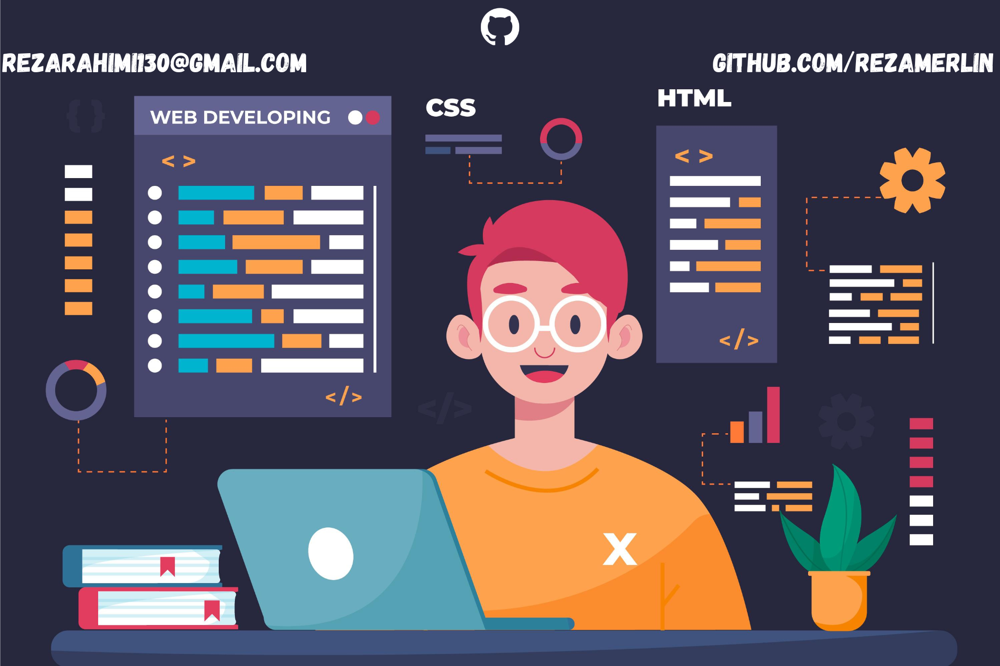

<!--Banner-->

<!--Header Name-->
#  ɪ'ᴍ Reza! 
*(Developer / Programmer)*
  

<!--Start Intro-->               

I am a Front-End Enthusiast from Iran with a strong passion for JavaScript and Python. I’m always learning and improving my skills, and I believe that every day is a new opportunity for growth. 

- ✨ Student of Life
- 🌱 Currently focused on learning Front-End Development, with an emphasis on React.js, HTML, and CSS.
- 💻 I have a Bachelor’s degree in Computer Science, and I'm excited to keep improving in this field.
- 🎮 I’m a fan of Dota 2 – I believe gaming helps enhance focus and problem-solving skills.

- 💡 Always eager to learn and collaborate with others – let’s connect!
<!--End Intro-->
